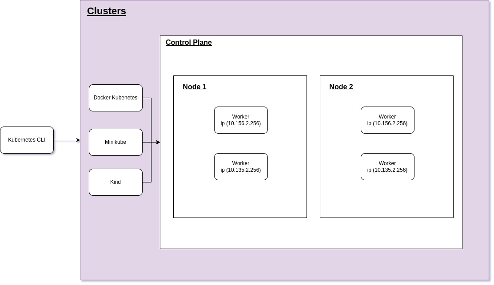
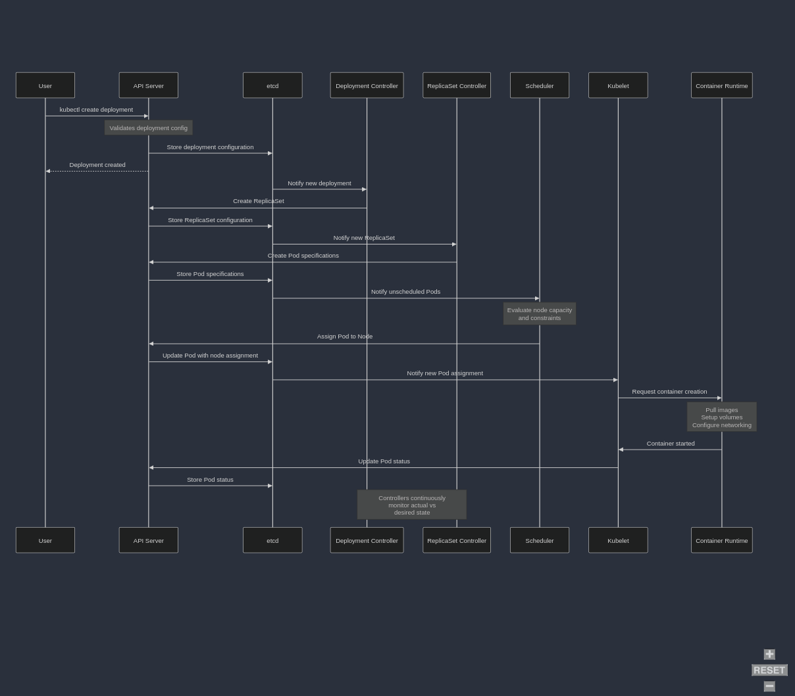

### Pending to study
- [ ] Create a customized component using kind and apiVersion
- [ ] Terraform

<details>

<summary>This is the architecture overview</summary>



</details>


<details>

<summary>Deployment break down</summary>



</details>

---
**⚠️ Important**  
Set kvm2 minikube driver 

```
minikube config set driver kvm2
```

---

<details>

<summary>Useful commands</summary>

```
minikube image load <your-image-name>:<tag>
```

```
minikube ssh "docker images"
```

```
minikube service java-app-service --url
```
    
</details>

---
<details>
<summary>Run java-app application</summary>

### Create docker image
``` 
gradle bootBuildImage
```

### Copy the image to minikube
``` 
minikube image load <your-image-name>:<tag>
```

### Kubectl Commands
#### Creates deployment
```
kubectl apply -f kubernetes/nodePort/deployment.yaml
```

#### Creates service
```
kubectl apply -f kubernetes/nodePort/serviceyaml
```

#### Creates deployment and service
``` 
kubectl apply -f kubernetes/nodePort
```

#### Verify the service url
```
minikube service java-app-service --url
```

</details>

---
<details>
<summary>Creating new replicaSet and rolling back</summary>

### Create the deployment
``` bash 
kubectl apply -f deployment.yaml
```

### List all replicaSets
``` bash 
kubectl get rs
```

### Change the image and then apply the new deployment
``` bash 
kubectl apply -f deployment.yaml
```

### Now there are 2 replicaSets
``` bash 
kubectl get rs
```

### History Revision
``` bash 
kubectl rollout history deployment/java-app
```

### Roll back
``` bash 
kubectl rollout undo deployment/java-app
```
</details>

---