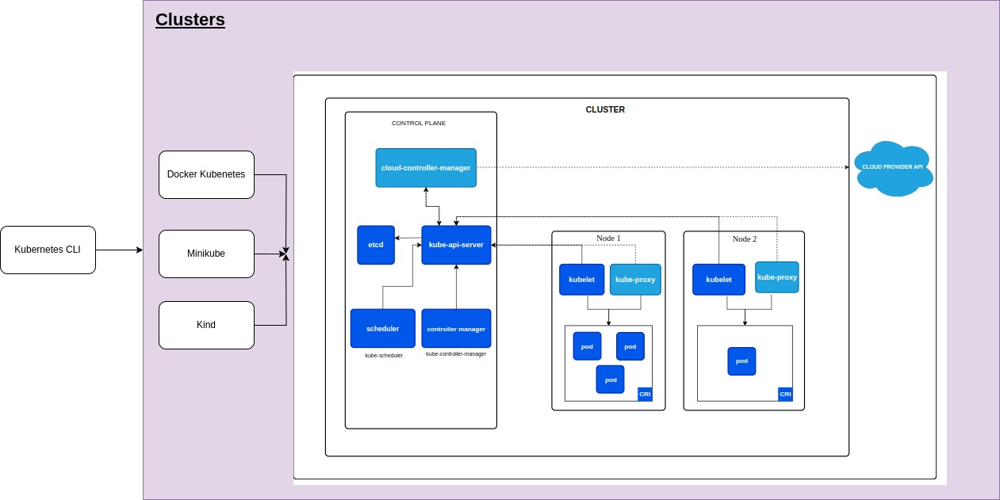

This is the architecture view:


### Pending to study
- [ ] Helm chart
- [ ] Service Account
- [ ] Create a kubernetes flow to understand each component

<details>
<summary>Run graalvm-cds application</summary>

## Create docker image
``` 
gradle bootBuildImage
```

## Kubectl Commands
### Creates deployment
```
kubectl apply -f kubernetes/nodePort/deployment.yaml
```

### Creates service
```
kubectl apply -f kubernetes/nodePort/serviceyaml
```

### Creates deployment and service
``` 
kubectl apply -f kubernetes/nodePort
```

### Request to service
``` 
http://localhost:30000/
```
</details>


<details>
<summary>Creating new replicaSet and rolling back</summary>

### Create the deployment
``` bash 
kubectl apply -f deployment.yaml
```

### List all replicaSets
``` bash 
kubectl get rs
```

### Change the image and then apply the new deployment
``` bash 
kubectl apply -f deployment.yaml
```

### Now there are 2 replicaSets
``` bash 
kubectl get rs
```

### History Revision
``` bash 
kubectl rollout history deployment/java-app
```

### Roll back
``` bash 
kubectl rollout undo deployment/java-app
```
</details>


